# Online Exam Testing Website

  

Welcome to the Online Exam Testing Website repository! This project is an interactive platform designed to help students practice and excel in their exams. The website provides a wide range of tests covering various subjects, real-time exam simulations, and detailed performance analysis to aid in effective exam preparation.

---

## Key Features

- **Diverse Test Categories:** Choose from a variety of tests covering different subjects and academic levels to match your learning needs.

- **Real-time Exam Simulation:** Experience exam-like conditions with timed tests and test your knowledge under pressure.

- **In-depth Performance Analysis:** Get detailed insights into your performance, identify strengths, weaknesses, and track your progress over time.

- **Interactive Learning Resources:** Explore educational resources, study tips, and exam preparation strategies to enhance your understanding.

- **Personalized Study Plans:** Receive tailored study plans based on your performance and academic goals.
---
## How to Use

1. **Sign Up:** Create a free account to access all features and gain personalized learning experiences.

2. **Choose a Test:** Select from our extensive collection of tests based on your subjects and academic level.

3. **Take the Test:** Start the exam simulation, answer questions, and submit your responses within the time limit.

4. **Review Results:** Analyze your performance, view correct and incorrect answers, and receive feedback for improvement.

5. **Track Progress:** Monitor your progress over time, set goals, and achieve academic success.
---
## Data Analysis with Graphs

The website provides detailed data analysis for each test you take. After completing a test, you can view graphical representations of your performance, including:

- Bar Charts: Compare correct and wrong marks for each question.
- Line Charts: Track your performance trend over multiple tests.
- Pie Charts: Visualize the percentage of correct and wrong answers for a test.
---
## Practice Test like Exams

We believe in preparing students with real exam experiences. Our practice tests simulate actual exam conditions, including timed tests and strict adherence to exam patterns. This approach helps students build confidence and perform better during actual exams.

---
## Screenshots
Here are some screenshots of the Testify website

**Welcome Page**: "Welcome to our welcome page of Testify Website !". 
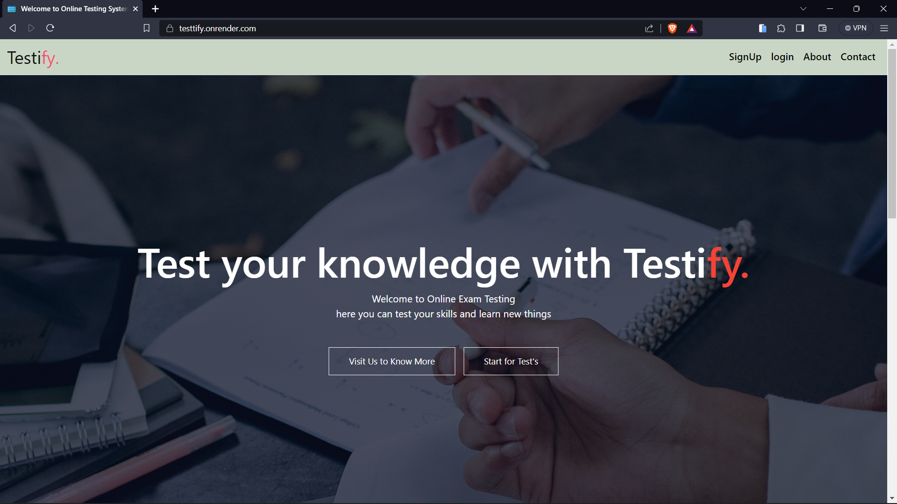

---
**Home Page**: "Welcome to our Home page of Testify Website,here user can access all features like to give test,create their own tests and also set test paper for others and more". 
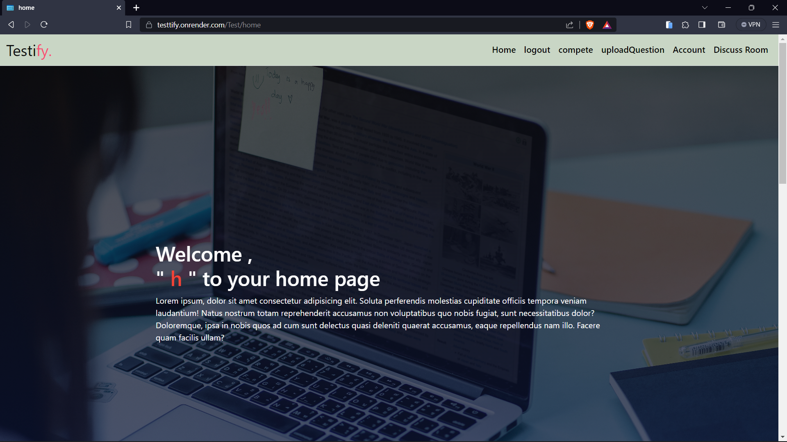
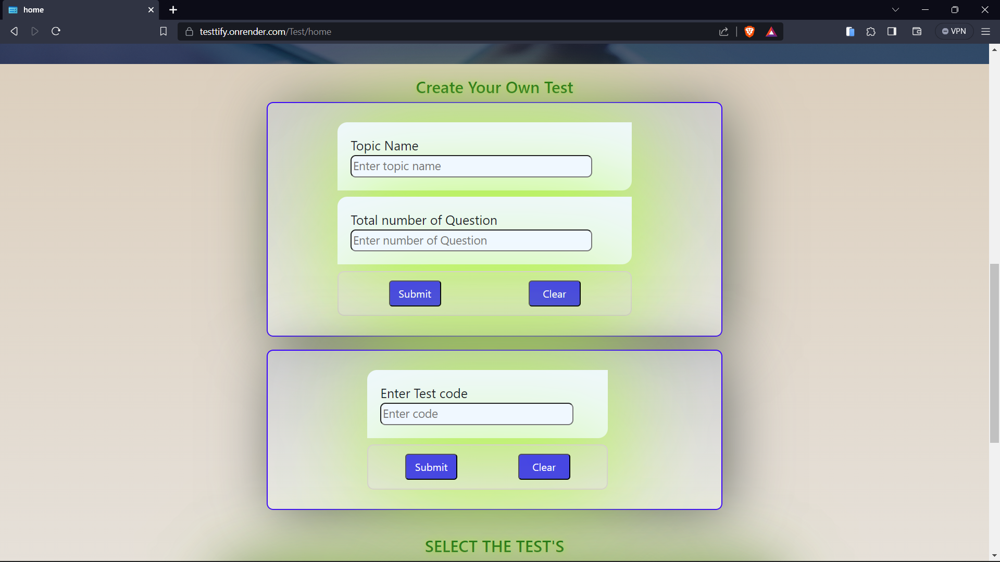
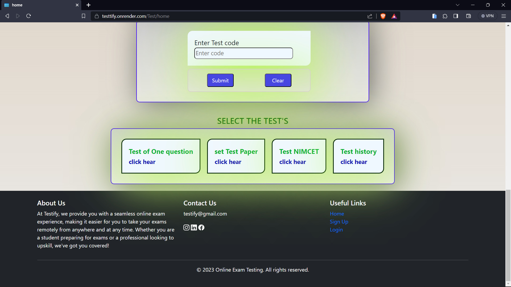

---
**Login Page**: "Welcome to our Login page of Testify Website"
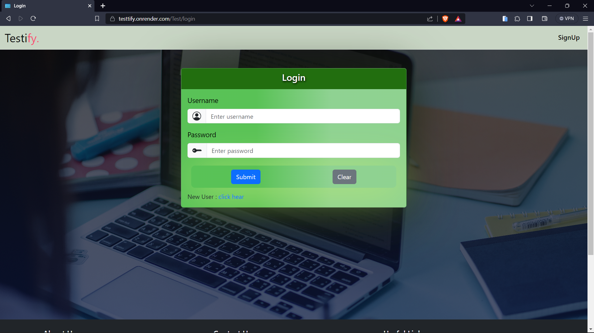

---
**SignUp Page**: "Welcome to our SignUp page of Testify Website 
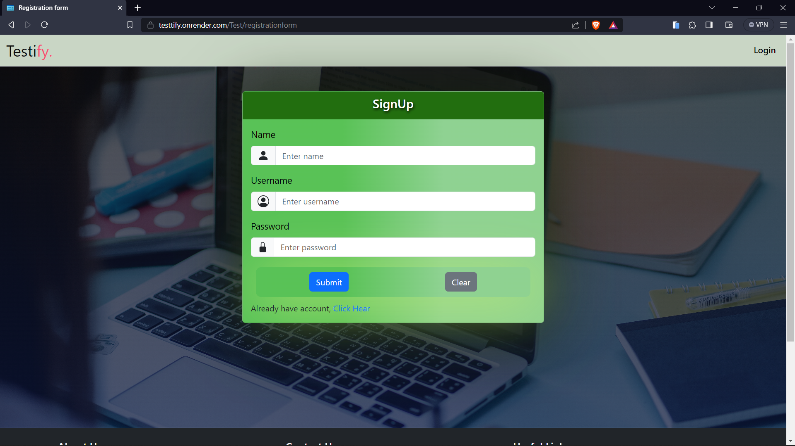

---
**Compete Page**: "Welcome to our compete page of Testify Website,here user will get all information about test"
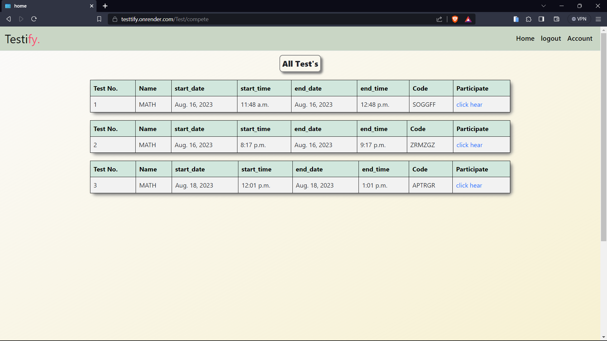

---
**Account Page**: "Welcome to our Account page of Testify Website, here user can get all information about profile and also able to update profile"
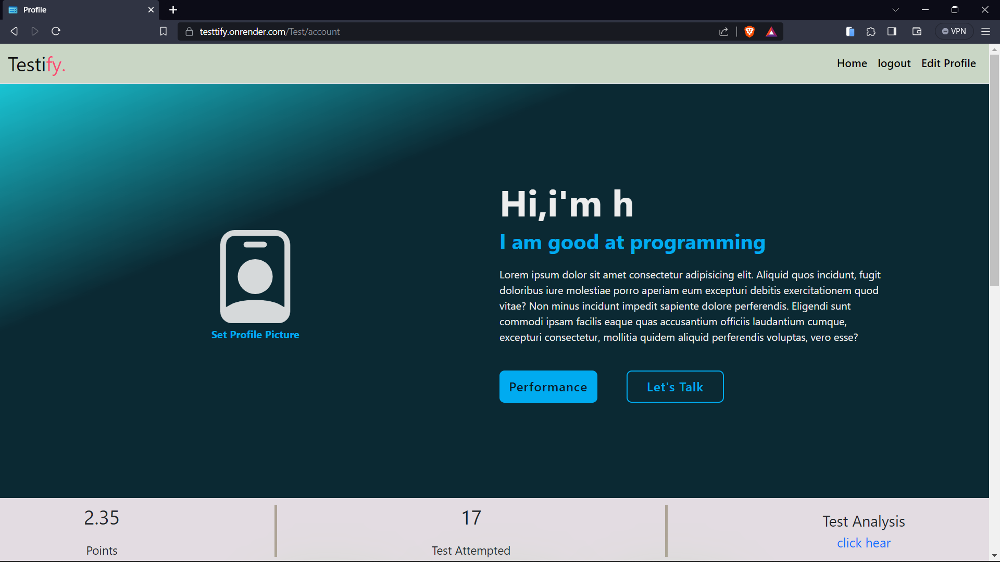
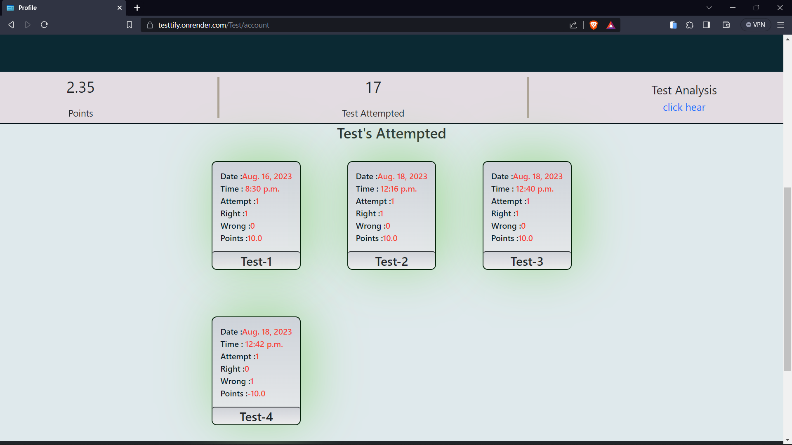

---
**Analysis Page**: "Welcome to Analysis page of Testify Website here user get details analysis of all the test performance with help of graphs"
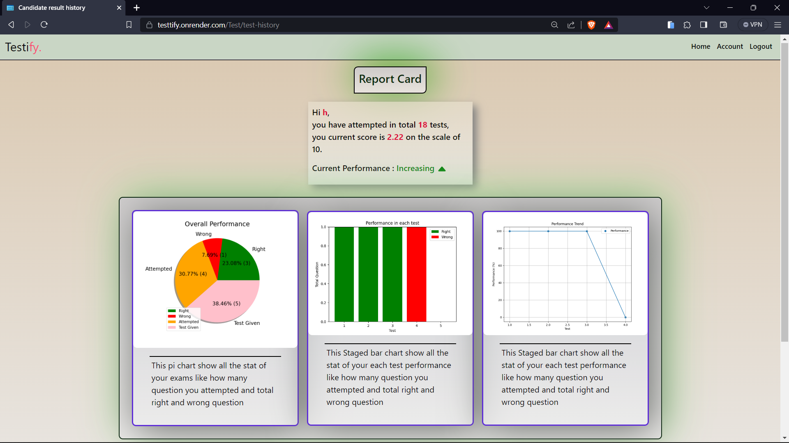

---
**UploadQuestion Page**: "Welcome to UploadQuestion page of Testify Website here user can contribute and upload questions with images"
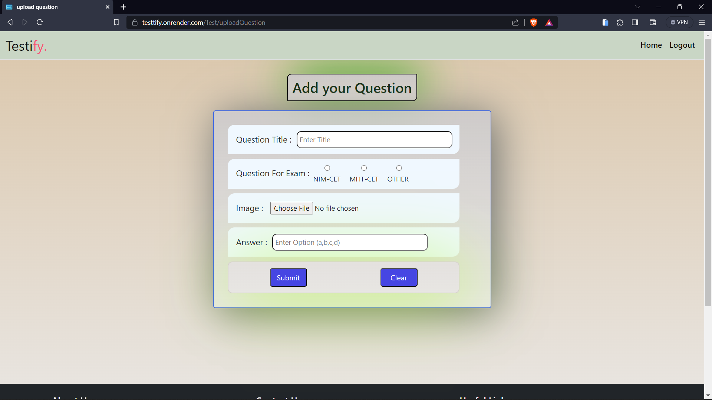

---

## Installation

1. Clone the repository to your local machine using the following command:
      
       git clone https://github.com/Harish-Kushwah/testify.git
 
2. Install the necessary dependencies by running:
     
       pip install -r requirements.txt

3. Set up a virtual environment to isolate the project's dependencies.

4. Run database migrations with the following command:
      
        python manage.py migrate

5. Start the development server using:
        
        python manage.py runserver

---

## Contribution Guidelines

We welcome contributions from the open-source community! If you have ideas for new features, bug fixes, or enhancements, feel free to submit pull requests. Check out our [contribution guidelines](contribute.md) for more information.

---
## Feedback and Support

We value your feedback and are here to help with any questions or issues. Please [open an issue](../../issues) if you encounter any problems or have suggestions for improvement.

---
## Visit Website

You can explore a live website [here](https://testtify.onrender.com/).

---
